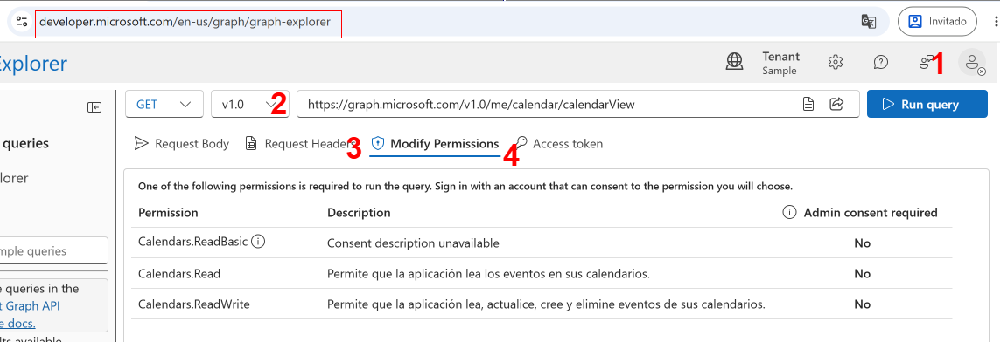

# 📅 Calendar Events Pipeline

Pipeline completo para descargar, procesar y visualizar eventos de calendario de **Microsoft Graph (Outlook/Microsoft 365)**, con generación de informes HTML interactivos y facturación integrada.

---

## ✨ Características principales

- **Descarga automática** de eventos desde Microsoft Graph con paginación completa
- **Agrupación por cliente y empresa** mediante mapeo configurable en YAML
- **Informe HTML autocontenido** con gráficos de barras, búsqueda y ordenación en tiempo real
- **Generación de facturas** directamente desde el informe, con datos persistidos en localStorage
- **Exportación CSV** de todos los eventos procesados
- **Soporte multi-mes** en una sola ejecución
- **Configuración centralizada** en un único archivo YAML

---

## 📁 Estructura del proyecto

```
.
├── main.py                  # Orquestador principal: fetch → process → report
├── core.py                  # Lógica compartida (agrupación, HTML, facturas, config)
├── get_calendar_events.py   # Descarga eventos de Microsoft Graph
├── process_events.py        # Procesa un único archivo JSON
├── report_events.py         # Genera informe desde un directorio de JSONs
├── config.example.yaml      # Plantilla de configuración
├── requirements.txt
└── reports/
    ├── config.yaml          # Tu configuración (créala a partir del ejemplo)
    ├── events/              # JSONs descargados de la API
    ├── processed/           # JSONs y CSVs procesados
    └── report.html          # Informe generado
```

---

## 🚀 Instalación

```bash
# Clonar el repositorio
git clone <repo-url>
cd calendar-events-pipeline

# Instalar dependencias
pip install -r requirements.txt
```

**Dependencias principales:** `requests`, `pyyaml`

---

## ⚙️ Configuración

Copia el archivo de ejemplo y edítalo con tus datos:

```bash
mkdir -p reports
cp config.example.yaml config.yaml
```

El archivo `config.yaml` controla:

### Datos de facturación

```yaml
invoice_defaults:
  from:
    name: "Tu Empresa S.L."
    tax_id: "B-12345678"
    email: "billing@tuempresa.com"
    address: "Calle Principal 123, 28001 Madrid"
    phone: "+34 900 123 456"
  defaults:
    hourly_rate: 75.0
    irpf_rate: 15.0
    payment_terms: "Pago a 30 días"
    bank_account: "ES00 0000 0000 0000 0000 0000"
```

### Agrupación por empresa

Mapea nombres de eventos/clientes a empresas para agruparlos en el informe:

```yaml
company_mapping:
  "Reunión de Sincronización": "Empresa A"
  "Daily Standup Meeting": "Empresa A"
  "Revisión de arquitectura técnica": "Empresa B"
  "Laura Martínez": "Laura Martínez"   # cliente individual
```

### Configuración por empresa o cliente

```yaml
company_settings:
  "Empresa A":
    defaults:
      hourly_rate: 85.0   # tarifa especial

client_settings:
  "Laura Martínez":
    defaults:
      hourly_rate: 60.0
```

### Preferencias del informe

```yaml
report_settings:
  auto_company_grouping: true
  show_bar_chart: true
  collapse_companies_by_default: false
  collapse_clients_by_default: true
```

---

## 🔑 Obtener el token de Microsoft Graph

1. Ve a [Microsoft Graph Explorer](https://developer.microsoft.com/en-us/graph/graph-explorer) y Inicia sesión con tu cuenta de Microsoft 365
2. Pon esta url en el cuadro de get: <https://graph.microsoft.com/v1.0/me/calendar/calendarView>
3. Asegúrate de que el permiso **`Calendars.Read`** y **`Calendars.ReadBasic`** está concedido en la seccion de **permissions granted**.
4. Ves a la **Access Token** y copialo



---

## Pipeline completo (recomendado)

### 1. Descargar el binario

Descarga el binario desde: <https://github.com/mauserkar/events/releases>

### 2. Dar permisos de ejecución

```bash
cd ~/Downloads
chmod +x events_macos_arm64
```

### 3. Añadirlo al PATH

```bash
mkdir -p ~/.local/bin
mv events_macos_arm64 ~/.local/bin/eventos
echo 'export PATH="$HOME/.local/bin:$PATH"' >> ~/.zshrc
source ~/.zshrc
```

---

## Uso básico

El token puede pasarse con `--token` o mediante la variable de entorno `TOKEN`:

```bash
export TOKEN=eyJ0eXAiOiJKV1Q...
```

```bash
# Un mes
events_macos_arm64 -m 3 -y 2026
 
# Varios meses
events_macos_arm64 --month 1 2 3 -y 2026
 
# Rango de meses (enero a junio)
events_macos_arm64 --month-range 1 6 -y 2026
```

---

## Opciones avanzadas

| Flag | Descripción |
|------|-------------|
| `-t`, `--token` | Token de Microsoft Graph |
| `-m`, `--month` | Mes(es) a descargar (1–12) |
| `--month-range FROM TO` | Rango inclusivo de meses |
| `-y`, `--year` | Año (ej. 2026) |
| `--skip-fetch` | Omite la descarga, reutiliza los JSONs existentes |
| `--skip-process` | Omite el procesado, regenera el HTML desde los procesados |
| `--input-file FILE` | Procesa un único archivo JSON en lugar de llamar a la API |
| `--output-dir DIR` | Directorio de salida para el informe HTML |
| `--no-normalize` | Desactiva la normalización de nombres |
| `--no-csv` | Omite la exportación CSV |
| `--no-company` | Desactiva la agrupación por empresa |

### Ejemplos de uso avanzado

```bash
# Reutilizar eventos ya descargados (sin red)
events_macos_arm64 --skip-fetch -y 2026
 
# Regenerar solo el HTML sin reprocesar
events_macos_arm64 --skip-fetch --skip-process
 
# Procesar un archivo concreto
events_macos_arm64 --input-file ./data/marzo.json
 
# Informe en directorio personalizado
events_macos_arm64 -m 5 -y 2026 --output-dir ./mis_informes

```

#### Opciones avanzadas de `main.py`

| Flag | Descripción |
|------|-------------|
| `-t`, `--token` | Token de Microsoft Graph |
| `-m`, `--month` | Mes(es) a descargar (1–12) |
| `--month-range FROM TO` | Rango inclusivo de meses |
| `-y`, `--year` | Año (ej. 2026) |
| `--skip-fetch` | Omite la descarga, reutiliza los JSONs existentes |
| `--skip-process` | Omite el procesado, regenera el HTML desde los procesados |
| `--input-file FILE` | Procesa un único archivo JSON en lugar de llamar a la API |
| `--output-dir DIR` | Directorio de salida para el informe HTML |
| `--no-normalize` | Desactiva la normalización de nombres |
| `--no-csv` | Omite la exportación CSV |
| `--no-company` | Desactiva la agrupación por empresa |

```bash
# Reutilizar eventos ya descargados (sin red)
events_macos_arm64 --skip-fetch -y 2026

# Regenerar solo el HTML sin reprocesar
events_macos_arm644 --skip-fetch --skip-process

# Procesar un archivo concreto
events_macos_arm644 --input-file ./data/marzo.json

# Informe en directorio personalizado
events_macos_arm644  -m 5 -y 2026 --output-dir ./mis_informes
```

---

### Herramientas individuales

#### Descargar eventos

```bash
python get_calendar_events.py -m 3 -y 2026 -t <TOKEN>
python get_calendar_events.py --month 1 2 3 -y 2026
python get_calendar_events.py --month-range 1 6 -y 2026
# Salida: reports/events/events_2026_03.json
```

#### Procesar un archivo

```bash
python process_events.py events.json
python process_events.py events.json --no-normalize
python process_events.py events.json --no-csv
python process_events.py events.json --no-company
# Salida: reports/processed/events.json y .csv
```

#### Generar informe desde un directorio

```bash
python report_events.py ./data/
python report_events.py ./data/ --output informe.html
python report_events.py ./data/ --csv          # también exporta CSV
python report_events.py ./data/ --no-company   # sin agrupación por empresa
```

---

## 📊 Informe HTML

El informe generado (`reports/report.html`) es un archivo **autocontenido** que no requiere servidor ni conexión a internet. Incluye:

- **Métricas globales**: archivos procesados, citas totales, clientes únicos, tiempo total
- **Secciones por archivo** colapsables con gráfico de barras
- **Agrupación jerárquica**: empresa → cliente → citas
- **Búsqueda en tiempo real** por nombre de cliente o empresa
- **Ordenación** por tiempo, número de citas o nombre
- **Generación de facturas** con vista previa lista para imprimir:
  - Datos del emisor persistidos entre sesiones (localStorage)
  - Tarifa por hora y IVA configurables
  - Factura consolidada por empresa o individual por cliente

---

## 📂 Formatos de archivo

### Entrada: JSON de Microsoft Graph

```json
[
  {
    "subject": "Reunión de Sincronización",
    "start": { "dateTime": "2026-03-10T10:00:00", "timeZone": "Europe/Madrid" },
    "end":   { "dateTime": "2026-03-10T11:00:00", "timeZone": "Europe/Madrid" }
  }
]
```

### Salida: JSON procesado (con agrupación por empresa)

```json
[
  {
    "company": "Empresa A",
    "total_appointments": 5,
    "total_minutes": 300,
    "total_time_formatted": "5h",
    "clients": [
      {
        "name": "Reunión de Sincronización",
        "total_appointments": 3,
        "total_minutes": 180,
        "total_time_formatted": "3h",
        "appointments": [...]
      }
    ]
  }
]
```

### Salida: CSV

```
company,client_name,subject,start,end,duration_min,duration,timezone
Empresa A,Reunión de Sincronización,Reunión de Sincronización,2026-03-10T10:00:00,...
```

---

## 🏗️ Arquitectura

```
                    ┌─────────────────┐
                    │   config.yaml   │  ← Mapeo empresa, tarifas, facturación
                    └────────┬────────┘
                             │
         ┌───────────────────┼───────────────────┐
         ▼                   ▼                   ▼
  get_calendar_events  process_events      report_events
  (descarga API)       (un archivo)        (directorio)
         │                   │                   │
         └───────────────────┴───────────────────┘
                             │
                         core.py
                    (lógica compartida)
                             │
                         main.py
                    (orquestador completo)
```

**`core.py`** centraliza toda la lógica:

- Carga y validación de eventos
- Normalización de nombres
- Agrupación por empresa y cliente
- Renderizado HTML y generación de facturas
- Exportación JSON y CSV

---

## 🔁 Flujo de trabajo típico

```bash
# 1. Configurar (solo la primera vez)
cp config.example.yaml config.yaml
# Editar config.yaml con tus datos

# 2. Ejecutar el pipeline completo
python main.py -t <TOKEN> --month-range 1 3 -y 2026

# 3. Abrir el informe
open reports/report.html          # macOS
xdg-open reports/report.html     # Linux
start reports/report.html         # Windows

# 4. Meses siguientes (reutilizar eventos ya descargados si no han cambiado)
python main.py --skip-fetch --skip-process   # regenerar solo el HTML
python main.py --skip-fetch -y 2026 -m 4    # reprocesar con nuevos datos
```

---

## 📦 Binarios precompilados

El repositorio incluye un workflow de GitHub Actions (`.github/workflows/build.yml`) que genera ejecutables autocontenidos con **Nuitka** para:

| Plataforma | Archivo |
|------------|---------|
| Linux x64 | `events_linux_x64` |
| Windows x64 | `events_windows_x64.exe` |
| macOS Intel | `events_macos_intel` |
| macOS Apple Silicon | `events_macos_arm64` |

Los binarios se publican automáticamente en **GitHub Releases** al crear un tag `v*`.

```bash
git tag v1.0.0
git push origin v1.0.0
```

---

## 🛠️ Desarrollo

### Ejecutar sin instalar

```bash
python -m venv .venv
source .venv/bin/activate        # Linux/macOS
.venv\Scripts\activate           # Windows
pip install -r requirements.txt
```

### Añadir un nuevo cliente al mapeo

Edita `config.yaml` y añade entradas en `company_mapping`:

```yaml
company_mapping:
  "Nombre del evento en el calendario": "Nombre de la Empresa"
```

Luego regenera el informe:

```bash
python main.py --skip-fetch -y 2026
```

---

## 📄 Licencia

MIT — libre para uso personal y comercial.
